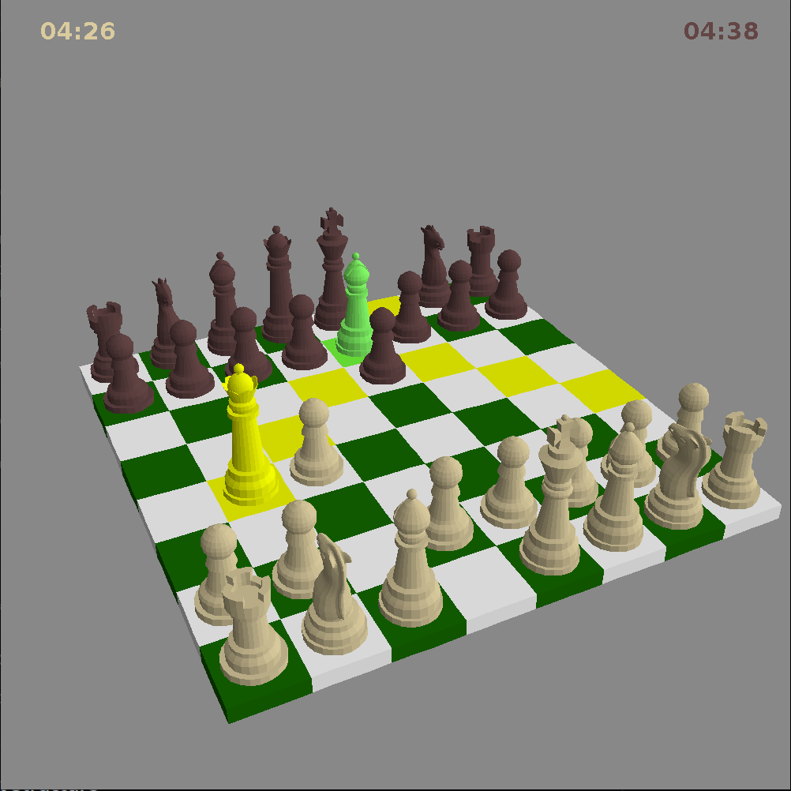

# Chess3D

A 3D Chess implementation written in pure Java. This project features a custom-built 3D rendering pipeline (software renderer) to display the board and pieces, integrated with a 2D Swing interface for game logic and controls.



## Features

- **Custom 3D Engine**: Loads `.obj` meshes and renders them with custom projection, camera handling, and directional lighting.
- **Classic Chess Rules**: Implements standard movement logic (Asian variant: no castling, no en passant).
- **Hybrid UI**: 3D view for visualization, 2D overlays for game status.
- **Move Validation**: Visual highlighting of legal moves; prevents illegal moves.
- **Pawn Promotion**: GUI dialog to select promotion piece (Queen, Rook, Bishop, Knight).

## Getting Started

### Prerequisites
- Java Development Kit (JDK) 17 or higher.
- Maven 3.6+ (optional, if building from command line).

### Build and Run

1. **Clone the repository:**
   ```bash
   git clone https://github.com/jdrp/chess-3d.git
   cd chess-3d
   ```

2. **Run using Maven:**
   ```bash
   mvn clean compile exec:java -Dexec.mainClass="ui.App"
   ```

3. **Build a standalone JAR:**
   ```bash
   mvn clean package
   java -jar target/chess3d-1.0.0-SNAPSHOT.jar
   ```

## Controls

- **Left Click**: Select a piece. Valid moves will be highlighted. Click a highlighted tile to move.
- **Right Click + Drag**: Rotate the 3D camera around the board.
- **Mouse Wheel**: Zoom in and out.

## Project Structure

- `rendering.*`: The custom 3D graphics pipeline (meshes, lighting, camera, rasterization).
- `chess.*`: Game logic, piece definitions, and move generation.
- `ui.*`: Application entry point and window management.

## Authors & Contributors

- **Javier Díaz de Rábago** ([@jdrp](https://github.com/jdrp)): 3D renderer implementation, graphics pipeline, OBJ loader, camera/projection logic, and rendering UI integration.
- **Carlos Marí** ([@CarlosMari](https://github.com/CarlosMari)): Chess engine logic, rule enforcement, move generation, and 2D Swing gameplay UI.

## License

This project is licensed under the MIT License - see the [LICENSE](LICENSE) file for details.